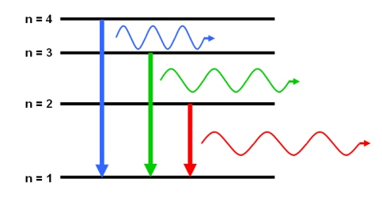

# Zeeman Effect
- M. Beekenkamp

## Introduction

In 1896, whilst teaching at the University of Leiden, the Dutch
Physicist Pieter Zeeman discovered the Zeeman Effect for which he would
later win a Nobel Prize. Based on Lorentz’s theory of electromagnetic
radiation, for whom Zeeman had TA’ed as an undergraduate student, Zeeman
noted the splitting of spectral lines under the presence of a large
magnetic field. This discovery confirmed Lorentz’s theory on polarised
light and showed the presence of the electron, although it would take a
further year before the it was discovered by J.J. Thomson. An example of
such spectral lines, and it’s splitting, is shown in Fig.1 & 2
respectively.

Example of spectral lines

Example of spectral lines under the presence of a magnetic field

A current passing through a mercury discharge tube ionises electrons in
the mercury causing photon emission. This leaves a space for an electron
from an outer shell to fall into the vacancy left by the ionised
electron. The act of the electron dropping emits quantised photons with
an energy equivalent to the energy level unique to each element. This
can be seen in Fig.3. These emitted photons are the spectral lines shown
in Fig.1.

Example of quantised atomic energy levels

Under a magnetic field these emitted photons split. The Planck-Einstein
relation (1) is a fundamental equation stating that photon energy is
proportional to its frequency. As the Zeeman interaction causes a change
in energy (7), it also changes the frequency of the emitted photons.
This change in frequency is what is observed in experimentally (Fig.2).

$$E=hf$$ Where:

The selection rules are restrictions on splitting due to conservation
rules on the system. The electron transition which results in photon
emission must also have a change of 1 in the angular momentum. As the
photon has a spin of 1, and angular momentum in the system must be
conserved, the atom’s angular momentum an intrinsic angular momentum or
"spin" of one, so that conservation of angular momentum in photon
emission requires a change of 1 in the atom’s angular momentum. This
yields the first selection rule (2):

$$\Delta m_s=0$$ Where:

Similarly the photon emission is accompanied by a change of 1 in the
orbital angular momentum quantum number and a change by 0 or 1 in the
magnetic quantum number. These yield the second (3) and third (4)
selection rules, combining into Eq.5:

$$\Delta l=\pm 1$$ $$\Delta m_l=0, \; \pm 1$$ Where:

$$\Delta j=0, \; \pm 1$$ $$\Delta j=l\pm s \; = l \pm \frac{1}{2}$$
Where:

The Zeeman interaction, the interaction energy of an electron with a
magnetic field, is thus defined by (7):

$$\Delta E=\frac{e}{2m_e}(\vec{L} + 2\vec{S}) \vec{B} = g_L \mu_B m_j B$$
$$\mu_B = \frac{e\hbar}{2m_e}$$ Where:

From (6)

$$J = \sqrt{j(j+1)}\hbar$$

The ẑ-component of the total angular momentum is

$$J_z = m_j\hbar, m_j = -j, -j+1, \dots, j-1, j$$

Meaning a magnetic field causes a single energy level to split into
$2J + 1$ components. This experiment analyses the
$7S \rightarrow 6P$ atomic transition in mercury. The $7S$ energy
level ($J=1, L=0, S=1$) splits into three components and the $6P$
energy level ($J=2, L=1, S=1$) splits into five. To calculate the
Landé g-factor for these energy levels Eq.11 is used:

$$g_L = 1 + \frac{j(j+1) + s(s+1) - l(l+1)}{2j(j+1)}$$

Resulting in $g_{7S} = 2$ and $g_{6P} = \frac{3}{2}$. These
splittings are shown in Fig.4. In this experiment the focus is on the
$\pi$ transitions. As $\sigma$ transitions are polarised at
$90^{\circ}$ relative to the magnetic field they can be blocked, with
the use of a polariser, whilst allowing the $\pi$ transitions to pass
through. Visually, in reference to Fig.4, the transitions analysed in
this experiment are
$m_j = 0; g=2 \rightarrow m_j = 0, \pm 1; g=\frac{3}{2}$. The equation
governing the energy shifts of the $\pi$ transitions is:

$$\Delta E = 0, \; \pm \frac{1}{2} \mu_B B$$

Energy levels diagram for $7S \rightarrow 6P$ splitting

Using a Fabry-Pérot interferometer, the change in frequency of the
Zeeman Effect is observed (Eq.1 & 12). Light passing through the
Fabry-Pérot interferometer will interfere constructively according to
Eq.13:

$$2d \cos{\theta} = n \lambda$$

Where:

Following small angle approximations, which are valid due to the fine
nature of this experiment, we get Eq.14 & 15:

$$n \approx \frac{2d}{\lambda}$$
$$\theta_p^2 = (p + \epsilon) \frac{\lambda}{d}$$
$$p = n_0 - n, \; \; \; \; \; 0 \le \epsilon \le 1$$ Where:

## EXPERIMENT

A schematic of the Fabry-Pérot interferometer.

The experiment had two parts, studying spectral lines and the Zeeman
Effect. For both parts "VirtualDub" was used to display the spectral
lines on a computer as shown in Fig.5.

### Spectral Lines

#### Measuring Wavelength by Spacing

Once viewing the spectral lines we rotated the micrometer, increasing
the distance between the mirrors, counting 20 rings which passed the
edge of a fixed point. We chose to open a blank notepad window to use as
a reference. This was repeated for each of the ten readings. This method
does not require any knowledge about the initial conditions of the
Fabry-Pérot interferometer only the relative change induced by the
micrometer.

Table I

|                                  |                    |
| :------------------------------: | :----------------: |
| **Number of Rings** |  **Counting Rings with Micrometer** |
|             ($mm$)             |                    |
|                0                 |         0          |
|           20 $\pm 1$           | 0.02 $\pm 0.005$ |
|           40 $\pm 1$            | 0.04 $\pm 0.005$  |
|           60 $\pm 1$           | 0.6 $\pm 0.005$  |
|           80 $\pm 1$            | 0.9 $\pm 0.005$  |
|          100 $\pm 1$           | 0.11 $\pm 0.005$  |
|          120 $\pm 1$           | 0.13 $\pm 0.005$  |
|          140 $\pm 1$           | 0.15 $\pm 0.005$ |
|          160 $\pm 1$           | 0.16 $\pm 0.005$  |
|           180 $\pm 1$           | 0.18 $\pm 0.005$ |
|          200 $\pm 1$           | 0.19 $\pm 0.005$  |

**Counting Rings with Micrometer**

#### Measuring Wavelength by Angle

Here, instead of looking at the effect of an increase in distance, we
measured the effect of a change of angle. By aligning the outermost
ring, which was still clearly differentiable, with the edge of the
screen, and rotating the camera we measured the spacing between each
ring. Once again this method does not require any knowledge about the
initial conditions of the Fabry-Pérot interferometer.

|                             |              |              |
| :-------------------------: | :----------: | :----------: |
| **Ring Order** |              |              |
|  ($\frac{1}{60} \; deg$)  |              |              |
|  ($\frac{1}{60} \; deg$)  |              |              |
|              0              |      17      |      62      |
|              1              | 26 $\pm 1$ | 53 $\pm 1$ |
|              2              | 34$\pm 1$  | 44 $\pm 1$ |
|              3              | 40 $\pm 1$ | 39 $\pm 1$ |
|              4              | 47 $\pm 1$ | 31 $\pm 1$ |
|              5              | 53$\pm 1$  | 24 $\pm 1$ |

**Counting Rings with Angle**

$$table:TableI$$

### Zeeman Splitting

For experiment B we are looking at the effect a B-Field has on the
spectral lines. At $0.2 A$ intervals one second videos were taken of
the observed spectral lines using "VirtualDub". Using "ImageJ" the
approximately 30 frames were averaged and created a horizontal profile
plot. For each B-Field we measured the average wavelength shift caused
by the Zeeman effect.

|                  |                   |
| :--------------: | :---------------: |
|                  |                   |
|     ($A$)      |                   |
|     ($V$)      |                   |
|        0         |         0         |
| 0.2 $\pm 0.05$ | 4.9 $\pm 0.05$  |
| 0.4$\pm 0.05$  |  9.7$\pm 0.05$  |
| 0.6 $\pm 0.05$ | 14.5 $\pm 0.05$ |
| 0.8$\pm 0.05$  | 19.5 $\pm 0.05$ |
| 1.0 $\pm 0.05$ | 24.2$\pm 0.05$  |
| 1.2 $\pm 0.05$ | 25.8$\pm 0.05$  |

**Strength of Magnetic Field**

$$table:TableI$$

## RESULTS AND ANALYSIS

### Spectral Lines

#### Measuring Wavelength by Spacing

The data obtained in Table I displays the relationship defined in Eq.14.
Specifically, the linear relationship between distance d and the
wavelength. After obtaining the data shown in Table I, using Eq.14 the
wavelength of green light emitted from the mercury vapour was
calculated. Graphically, as shown in Fig.6, this is the gradient of the
linear regression.

Energy levels diagram for $7S \rightarrow 6P$ splitting

  

#### Measuring Wavelength with Angle

Here, using Eq.15 and the data in Table II, the linear relationship
between $\theta^2$ and $p$ is shown in Fig.7. The gradient of the
linear regression is again the wavelength of the green light emitted
from the mercury vapour.

Energy levels diagram for $7S \rightarrow 6P$ splitting

  

The resulting wavelengths and their errors are listed in Table IV.

| **Experiment** | **Wavelength $\lambda$, ($nm$)** | **Error** |
| :-------------------------: | :-----------------------------------------------: | :--------------------: |
|         Theoretical         |                       546.1                       |           \-           |
|        Experiment 1         |                498.0 $\pm 176.2$                |       $8.81\%$       |
|        Experiment 2         |                423.1 $\pm 231.7$                |      $22.52\%$       |

**Results from Experiment A**

$$table:TableI$$

Both of the experimental values for wavelength have the correct order of
magnitude. Given the possible errors from difficulty operating the lab
equipment, most notably the dials to change $d$ and $\theta$ not
providing fine enough control, and the lack of knowledge about our
initial conditions, the result matches the theoretical expectations.

### Zeeman Splitting

Seven scans were done in this experiment, shown in Table III. Each scan
produced an averaged horizontal profile plot (HPFP) showing the
intensity for each pixel of a line along the middle of images such as
the ones seen in Fig.1 & 2.

Energy levels diagram for $7S \rightarrow 6P$ splitting

  

To find the relationship described in the Zeeman effect, Eq.12., the
peaks of the HPFPs were found using the Scipy function "find\_peaks".
This is shown in Fig.8 & 9. As the B-Field increased however, there was
the find\_peaks function created a lot of noise, shown in Fig.9, calling
for some data cleansing.

Energy levels diagram for $7S \rightarrow 6P$ splitting

  

Having found these peaks, we measured the wavelength shift (in pixels),
left and right, from the central peak. These values were subsequently
converted to metres using Eq.17, and used as the data set for Fig.10.

$$r = \frac{\lambda}{P}$$ Where:

As the strength of the magnetic field remains linearly proportional to
current for Helmholtz Coils, and because we could not measure the actual
strength of the magnet, we used the current as the independent variable
shown in Fig.10.

Energy levels diagram for $7S \rightarrow 6P$ splitting

  

The resulting energy shifts and their errors are listed in Table V.

| **Experiment** | **Magnetic Moment ($J \cdot T^-1$ )** | **Error** |
| :-------------------------: | :--------------------------------------------------: | :--------------------: |
|         Theoretical         |              $\pm 4.637 \cdot 10^-24$              |           \-           |
|              E              |               $+ 1.692 \cdot 10^-18$               |          n/a           |
|              E              |               $- 1.692 \cdot 10^-18$               |          n/a           |

**Results from Experiment B**

$$table:TableI$$

The observed experimental result does not accurately reproduce Zeeman’s
findings. However, the results are internally consistent, the gradient
of both the spin up and spin down $\pi$ readings are the same,
indicating that there was a systematic error in our work. This is likely
due to an incorrect pixel to metre conversion calculation.

## CONCLUSIONS

In this lab experiment, we were able to investigate the Zeeman effect.
Specifically, Zeeman splitting was measured using computer software and
the Fabry-Pérot interferometer. Using two different methods to calculate
wavelength, we demonstrated the multiple practical ways to measure
wavelengths each relying on seperate measurements. These experimental
values had the correct order of magnitudes, however, large
simplifications and assumptions undoubtedly limited the potential
accuracy of our results. Considering the equipment’s limitation and
uncertainty, it is a very good result. Finally, Zeeman Splitting was
demonstrated by measuring how the presence of a B-Field shifted the
wavelength. Although the experimental value of the gradient of the
linear regression shown in Fig.10 was internally consistent, the
experimental value of this gradient failed to effectively support
Zeeman’s findings.
